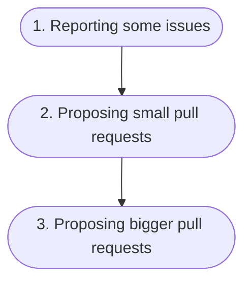
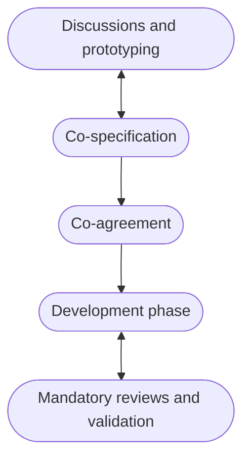

# Orange Open-Source Design System and Its Bootstrap Fork

by Julien Déramond

  
  

    
OW2con'24

    
June 12th, 2024

  

  <a href="https://github.com/julien-deramond/talks/tree/main/ow2con24" alt="GitHub" title="Open in GitHub"
    class="text-xl slidev-icon-btn opacity-50 !border-none !hover:text-white">
    <carbon-logo-github />
  </a>

<!--
Hello there!

Welcome to this mini-talk about our open-source Orange Design System, accessibility, and a bit of upstream open-source contributions.
-->

---

# 10 Years Ago…

back to 2013-2014

Accessibility was already in Orange DNA

The dedicated transversal accessibility entity was:
  - providing guidelines
    - _Orange digital accessibility guidelines_ at https://a11y-guidelines.orange.com
  - sharing best practices
  - providing support and training to the teams
  - auditing the Orange digital products

<v-click>

And 10 years ago, they were already **repeating over and over the same things during the audits**.

Stuff like:

> A `
` is not a `<button>`!

</v-click>

<!--
Let's jump back directly 10 years ago, around 2013-2014, through the lens of the accessibility transversal entity at Orange.

Accessibility was already in Orange DNA back then, and this dedicated entity was already:

- providing guidelines (that you can find at https://a11y-guidelines.orange.com),
- sharing best practices,
- providing support and training to the teams,
- auditing the Orange digital products

#### (Click)

And especially for the web ones, 10 years ago, they were repeating over and over the same things during the audits, things like "A `
` is not a `<button>`!". You know what I mean, the basics.
-->

---

# How to Enforce the Accessibility Guidelines?

Web developers needed some help to respect the guidelines

<v-click>

Create a web UI library with reusable components

</v-click>

<v-click>

- But
  - it required a lot of resources
  - it wasn't too common back then (at least, not as common as it is today)

</v-click>

<v-click>

- Studied the existing open-source UI libraries and frameworks
  - Reuse something and not reinvent the wheel
  - Bootstrap started to be a reference

</v-click>

<!--
So, the question was: how to enforce these accessibility guidelines for the web developers at Orange.

#### (Click)

One solution was to create a web UI library with reusable components

#### (Click)

but it required a lot of resources to put that in place, and it wasn't too common back then. At least, not as common as it is today.

#### (Click)

So they studied the existing open-source web UI libraries and frameworks to see if they could reuse something and not reinvent the wheel. And to be honest, there were not a lot of choices back then. However, in 2013-2014, Bootstrap started to be a reference.
-->

---
layout: center
---

  

    
    

      Build fast, responsive sites with Bootstrap
    

    

      
      
      
       
      
    

  

  

  - HTML, CSS, JavaScript framework
  - Customizable components with Sass
  - CDN compatible
  - Utilities and helpers
  - Responsive design

  

<!--
In a few words: What's Bootstrap?

Bootstrap is a web framework containing customizable, responsive and accessible components, utilities and examples to build all types of websites. Everything is developed in HTML, CSS and JavaScript. It’s been created by Twitter employees and then finally released in open source in 2011. The current version is the 5.3.3. 

In terms of numbers, it's the 22nd most starred project on GitHub. Last year, it was the 4th most starred library, with over 165 000 stars (one hundred sixty five thousand stars). The NPM package is downloaded 6 millions time per week. According to W3Techs, Bootstrap is used by around 19% of all websites.
-->

---

# Let’s Make a Fork of Bootstrap!

Bootstrap's a good fit to enforce accessibility guidelines

1. **Audit of Bootstrap** → really good accessibility compliance

<v-click>

2. **Fork of Bootstrap** with an MIT license → usable by all Orange teams, subsidiaries, etc.

</v-click>
<v-click>

3. **Customization of Bootstrap** → automatically apply the brand and design guidelines

</v-click>

<!--
So Bootstrap was a good fit for our accessibility team as a starting point as it was audited, and provided a really good accessibility compliance.

#### (Click)

In order to make it available to all Orange teams, subsidiaries, etc. they forked Bootstrap and made it open source too, with an MIT License under the name of Boosted.

#### (Click)

But Bootstrap came with its own rendering, so they started to override the Bootstrap styles to make it look like the Orange guidelines.

And that was the smart move and what triggered the adoption. Not the accessibility built-in features, but the brand compatible ready-to-use components, as it eased the life of web developers.
-->

---
layout: center
---

  

    

      Boosted
    

    

      Build fast, responsive sites with Boosted
    

    

      
      
      
       
      
    

    
  

  

  - HTML, CSS, JS framework
  - Customized Orange components
  - Accessible
  - Utilities and helpers
  - Responsive design

  

<!--
So Boosted was born in 2014 as a continuously maintained fork of Bootstrap.

It is open source with an MIT license.

It contains all the Bootstrap content, including accessibility, but customized to respect Orange design guidelines, and enhanced with some custom Orange-specific components.
-->

---
layout: center
---

  

    

      Free
    

  

  

  - features and improvements
  - bug fixes
  - security fixes
  - accessibility fixes
  - testing by millions of users in different contexts

  

<!--
Being a fork has some benefits:
- Free features and improvements
- Free bug fixes
- Free security fixes
- Free accessibility fixes
- Free testing by millions of users in different contexts

It looks like a one-way relationship, and it was at the beginning. But here's what came next.
-->

---
layout: center
class: text-center
---

# First Upstream Contributions to Bootstrap

between 2013 and 2018

<!--
As Bootstrap was heavily used by Orange websites through Boosted, some issues came up.

Boosted being a fork of Bootstrap, the core team acquired some expertise around the framework, and were able to fix these issues.

But instead of just fixing Boosted, they contributed upstream to Bootstrap by reporting issues and making small pull requests, especially for accessibility.

These fixes helped the Bootstrap community, so potentially millions of users, and were added back to Boosted during updates.

And this continued until 2018-2019.
-->

---

# More and More Upstream Contributions

between 2018 and 2020

Boosted had finally a full-time dedicated maintainer who followed the same pattern:

<v-click>

</v-click>

Like the RTL support!

<v-click>

Thanks to his great contributions, Gaël Poupard ([@ffoodd](https://github.com/ffoodd)) was invited to join the Bootstrap core team.

</v-click>

<!--
Around 2018, Boosted had finally a dedicated developer, who was able to contribute more and more to Bootstrap, and who followed the same upstream contributions pattern.

#### (Click)

Reporting some issues, proposing small pull requests, and then proposing bigger pull requests.

#### (Click)

And when I say bigger pull requests, I mean big pull requests, such as the RTL support for Bootstrap!

#### (Click)

Thanks to his great contributions, Gaël Poupard ([@ffoodd](https://github.com/ffoodd)) was invited to join the Bootstrap core team!
-->

---

# Boosted: Starting Point of Orange Design System

- Orange Design System was created in 2020.
- Boosted was at the core of it for the tech part as it was:
  1. already widely used (by hundreds of projects)
  2. qualitative
  3. and accessible

<v-click>

ℹ️ **What's a design system?** It's a big toolbox containing all the elements one needs to build a digital product such as a website or an application. It's a set of design guidelines, assets, icons, components, tech libraries, accessibility guidelines, etc. Everything for a consistent great user experience for a brand or a company.

</v-click>

<!--
Orange Design System was created mid-2020.

Boosted was at the core of it for the tech part as it was:
- already widely used by hundreds of projects
- qualitative
- and accessible

#### (Click)

This is not the main topic of this talk, but in a few words, a design system is like a big toolbox containing all the elements one needs to build a digital product, such as a website or a mobile, or TV application. It's a set of design guidelines, assets, icons, components, tech libraries, accessibility guidelines, etc. Everything for a consistent great user experience for a brand or a company.
-->

---

# Team’s Bigger, Contributions Are Bigger

In 2020, change of hands.

The previous maintainer left Orange.

I became the new maintainer of Boosted, and quickly followed the same pattern of upstream contributions:

<v-click>

Same upstream contributions pattern was followed by another member of the current Boosted core team months later who also became Bootstrap's core team member.

</v-click>

<!--
Just before this integration within Orange Design System, the previous maintainer left Orange, and I became the new maintainer of Boosted.

I followed the exact same pattern of upstream contributions:
1. Reporting some issues
2. Proposing small pull requests
3. Proposing bigger pull requests
4. And finally joined the Bootstrap core team in 2022

#### (Click)

The same contributions pattern was followed by another member of the current Boosted core team months later who also became Bootstrap's core team member.
-->

---

# Contributions Linked to Orange

_Data manually gathered the 7th of June 2024, it may contain errors_

| Contribution type | Linked to Orange | Bootstrap | Percentage linked to Orange |
|---|---|---|---|
| Issues (created) | 100 | 22,396 | 0.4% |
| Pull requests (created) | 840 | 15,199 | 5.5% |
| Commits | 920 | 22,813 | 4% |

 

<v-switch>
<template #1>

* 10 developers linked to Orange have contributed to Bootstrap along the years
* 4 developers linked to Orange are in the Bootstrap's core team (not all of them are still active)
* 2 developers linked to Orange are in the top 8 contributors of all time (4 in the top 20)

</template>

<template #2>

* "Linked to Orange" because:
  * some are not Orange employees anymore,
  * some are still working at Orange,
  * and some contribute on their spare time

</template>

</v-switch>

<!--
Sources:
- Commits: https://github.com/twbs/bootstrap/graphs/contributors
- PRs: https://github.com/twbs/bootstrap/pulls
- Issues: https://github.com/twbs/bootstrap/issues

People linked to Orange:
- Vincent Aniort | [@Aniort](https://github.com/Aniort)
- Isabelle Chanclou | [@isabellechanclou](https://github.com/isabellechanclou)
- Julien Déramond | [@julien-deramond](https://github.com/julien-deramond)
- Yves Gatesoupe | [@ygatesoupe](https://github.com/ygatesoupe)
- Hannah Issermann | [@hannahiss](https://github.com/hannahiss)
- Loïc Laussel | [@Lausselloic](https://github.com/Lausselloic)
- Mewen Le Hô | [@MewenLeHo](https://github.com/MewenLeHo)
- Louis-Maxime Piton | [@louismaximepiton](https://github.com/louismaximepiton)
- Gaël Poupard | [@ffoodd](https://github.com/ffoodd)
- Johann Servoire | [@Johann-S](https://github.com/Johann-S)
-->

<!--
I've gathered some data from GitHub, hoping it's accurate.

What we can see is that in the GitHub Bootstrap repository:
- 0.4% of the issues created are linked to Orange (Bootstrap total includes duplicates, spams, etc.)
- 5.5% of the pull requests created are linked to Orange (Bootstrap total includes Dependabot)
- 4% of the commits are linked to Orange

#### (Click)

- 10 developers linked to Orange have contributed to Bootstrap along the years
- 4 developers linked to Orange are in the Bootstrap's core team (not all of them are still active)
- 2 developers linked to Orange are in the top 8 contributors of all time (4 in the top 20)

#### (Click)

When I say "linked to Orange", it's because some are not Orange employees anymore, some are still working at Orange, and some contribute on their spare time.
-->

---
class: w-150
---

# Win-Win Relationship

Between Orange and Bootstrap

Now, we can say that the relationship between Orange and Bootstrap is a win-win relationship.

- Orange benefits from the free aspect of Bootstrap.
- Bootstrap benefits from the contributions of the Orange team, and the maintainers that are part of the core team.

<v-click>

⚠️ There's a subtlety here as my contributions started on Orange time, but now are  mostly done on my spare time.

</v-click>

<!--
So from quite some time now, we can probably say that the relationship between Orange and Bootstrap is a win-win relationship.

- Orange benefits from the free aspect of Bootstrap (features, bug fixes, etc.)
- Bootstrap benefits from the contributions of the Orange team, and the maintainers that are part of the core team.

#### (Click)

However, and this could be in another talk about work/life/oss balance, there's a subtlety here as in some cases, at least mine, as most of the contributions and maintenance parts are now done on my spare time.
-->

---

# Open-Source Design System

Each tech repository is open-source with an MIT license.

- **1 web framework**: our fork of Bootstrap, [Boosted](https://github.com/Orange-OpenSource/Orange-Boosted-Bootstrap)
- **2 web libraries**
  - [a map/cartography library](https://github.com/Orange-OpenSource/IOT-Map-Component) based on [Leaflet](https://leafletjs.com/)
  - [a charts library](https://github.com/orange-OpenSource/ods-charts) based on [Apache ECharts](https://echarts.apache.org)
- **3 mobile libraries** for [Android](https://github.com/Orange-OpenSource/ods-android), [iOS](https://github.com/Orange-OpenSource/ods-ios), and [Flutter](https://github.com/Orange-OpenSource/ods-flutter)
- **3 Orange themes** for [Jekyll](https://github.com/Orange-OpenSource/ods-jekyll-theme), [MkDocs](https://github.com/Orange-OpenSource/ods-mkdocs-theme), and [Storybook](https://github.com/Orange-OpenSource/ods-storybook-theme)

<!--
For the tech part of our Orange Design System, each repository is open-source with an MIT license.

We got:
- 1 web framework: our fork of Bootstrap, Boosted
- 2 web libraries
 - a map/cartography library based on Leaflet
   - we had exchanges with the creator around accessibility by creating issues in our repo, he came to provide answers and/or confirm the problems
 - a charts library based on Apache ECharts where we hope to contribute upstream too whenever our library will get out of alpha
- 3 mobile libraries for Android, iOS, and Flutter, based on the same principles as Boosted
  - It’s less true in terms of upstream contribution, but few companies have their mobile libraries in open source in their DS, so we hope it can help other companies to architect their libraries for example
- 3 Orange themes for Jekyll, MkDocs, and Storybook

Having our libraries in open source is a good way to communicate with other external companies that can see that we are ready to exchange, to share our code, to be in a dynamic of progression together on this subject
-->

---
layout: center
class: text-center
---

# ODS Simplified Development Process

Designers, developers, and accessibility experts meet weekly

<!--
Few words about the development process of these libraries.

Each week, accessibility experts, designers and developers of the Orange Design System core team meet and collaborate to co-construct reusable components.

During these weekly meetings, we follow the exact same pattern each time to create a new component or to improve an existing one.

The first step is discussions and prototyping. We discuss the component, its features, its behavior, its accessibility, and we prototype it.

Then, we co-specify and co-agree on the component before starting the development phase.

There's the development phase, and then the mandatory reviews and validation by another developer, a designer, and an accessibility expert.

All of that ensures a high-quality result for projects using our libraries, our components, and so a great final experience for Orange end-users.
-->

---
layout: center
class: text-center
---

# Julien Déramond

Now, let me introduce myself without spoiling the presentation

 [Orange Design System](https://system.design.orange.com/) tech lead

 Maintainer of [Boosted](https://boosted.orange.com/) and [Orange Design System](https://system.design.orange.com/) web libraries, and tools

 [Bootstrap](https://getbootstrap.com/) core team member

 [openresource.dev](https://openresource.dev) creator

<a href="https://github.com/julien-deramond" alt="GitHub" title="Open in GitHub" class="text-xl slidev-icon-btn opacity-50 !border-none !hover:text-white">
  <carbon-logo-github />
</a> · <a href="https://www.linkedin.com/in/julienderamond" alt="LinkedIn" title="Open in LinkedIn" class="text-xl slidev-icon-btn opacity-50 !border-none !hover:text-white">
  <carbon-logo-linkedin />
</a> · <a href="https://x.com/JulienDeramond" alt="X" title="Open in X" class="text-xl slidev-icon-btn opacity-50 !border-none !hover:text-white">
  <carbon-logo-x />
</a>

<!--
It was a bit complicated to introduce myself at the beginning of the presentation without spoiling the content, so I'm Julien Déramond, Tech Lead of Orange Design System, maintainer of Boosted and Orange Design System web libraries, and Bootstrap maintainer. I've recently created a new open-source project named Open {re}Source, a platform to share guides and resources around open source, you can check this out at openresource.dev.

Thanks a lot for your attention, and feel free to contact me on social networks. You'll find the link in the slides that are available on GitHub.
-->

---
layout: center
class: text-center
---

# Thank you!

Presentation under the [CC BY-SA 4.0 license](https://creativecommons.org/licenses/by-sa/4.0/)

